# ⛅ The Weather Forecast App

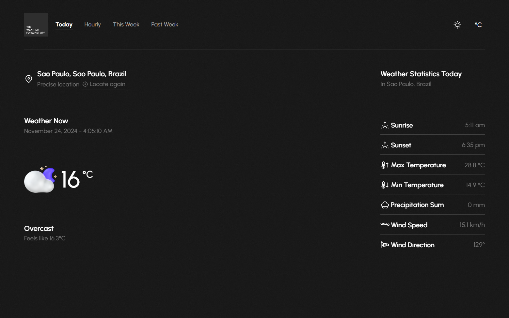

A modern and interactive weather forecast web app built with React framework, utilizing React Router for navigation, Vite for faster development, Moment.js for date handling, AOS (Animate On Scroll) for smooth animations, and Open Meteo API for fetching weather data. The app provides users with (almost) accurate weather information for their precise location, displaying today's weather, hourly forecasts, and a weekly outlook.

**Live Demo:** [Click Here](https://twfa.netlify.app/)

## ✨ Key Features

- **Real-Time Weather Data**: Get current weather conditions including temperature, humidity, and wind speed
- **Location-Based Forecast**: Automatic location detection for precise weather information
- **Hourly Predictions**: Detailed hourly weather forecasts with intuitive icons
- **Weekly Outlook**: 7-day weather forecast with temperature ranges and conditions
- **Dark/Light Mode**: Toggle between dark and light themes for comfortable viewing
- **Responsive Design**: Optimized for all devices - mobile, tablet, and desktop
- **Smooth Animations**: Enhanced user experience with AOS library animations

## 🛠️ Built With

- **[React](https://reactjs.org/)** - Frontend library for building user interfaces
- **[Vite](https://vitejs.dev/)** - Next generation frontend tooling
- **[React Router](https://reactrouter.com/)** - Navigation and routing
- **[Moment.js](https://momentjs.com/)** - Date formatting and manipulation
- **[AOS](https://michalsnik.github.io/aos/)** - Animate On Scroll library
- **[Open Meteo API](https://open-meteo.com/)** - Weather data provider
- **[Tailwind CSS](https://tailwindcss.com/)** - Utility-first CSS framework

## 📸 Screenshots

### Desktop Screenshots

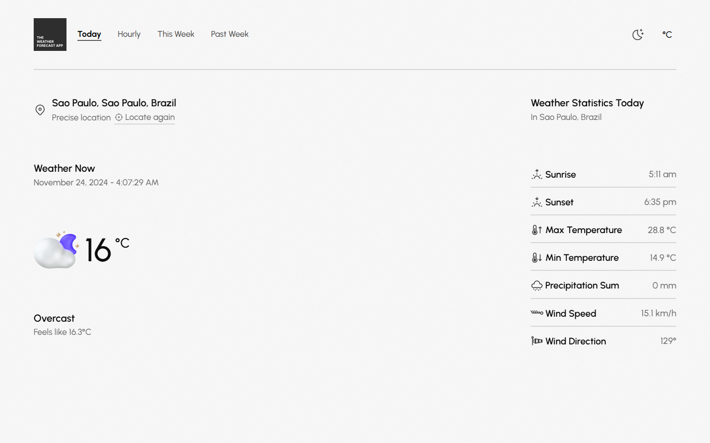
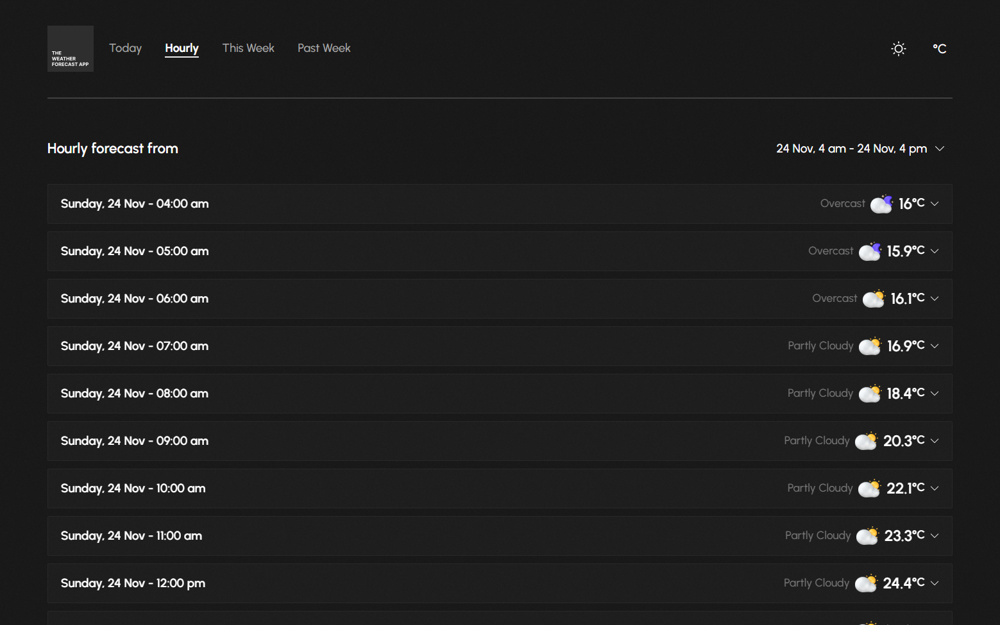
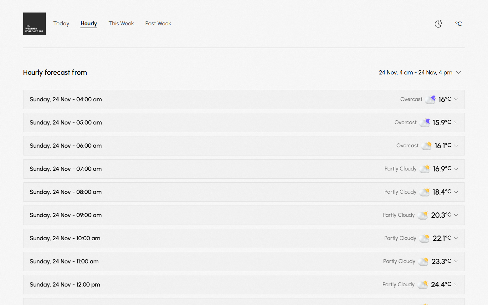
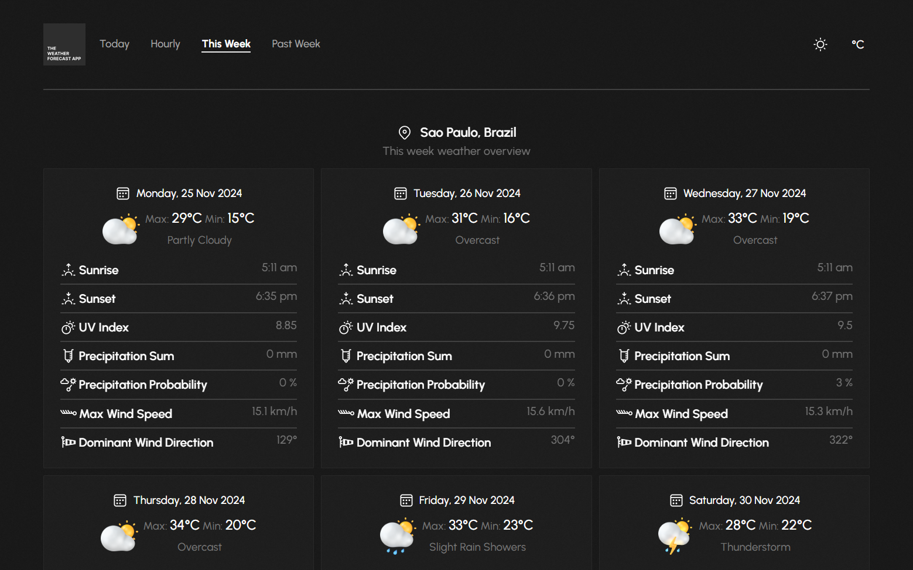
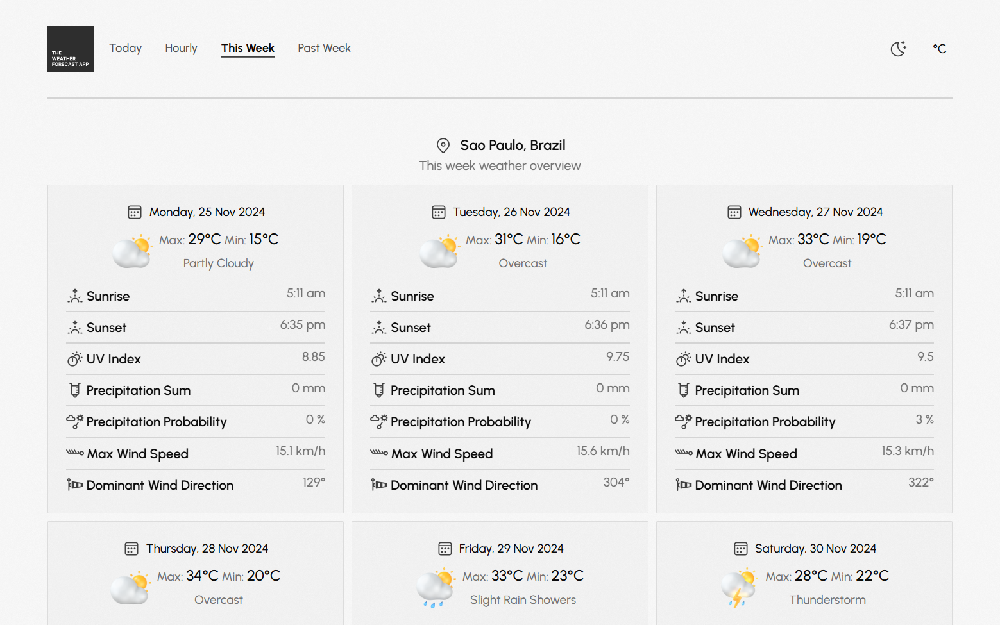
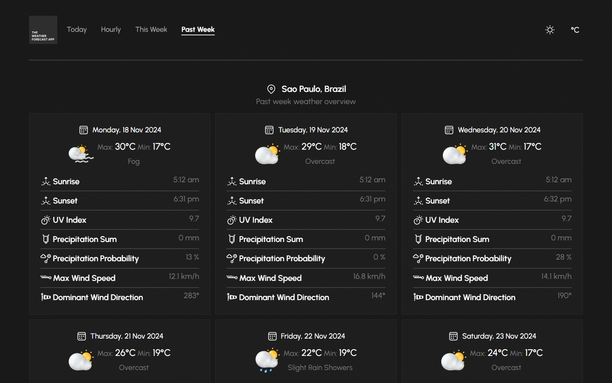
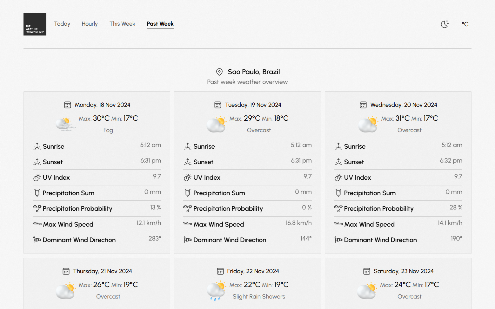

### Mobile Screenshots
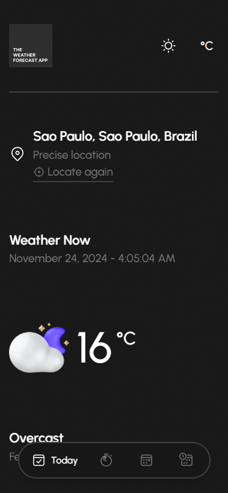
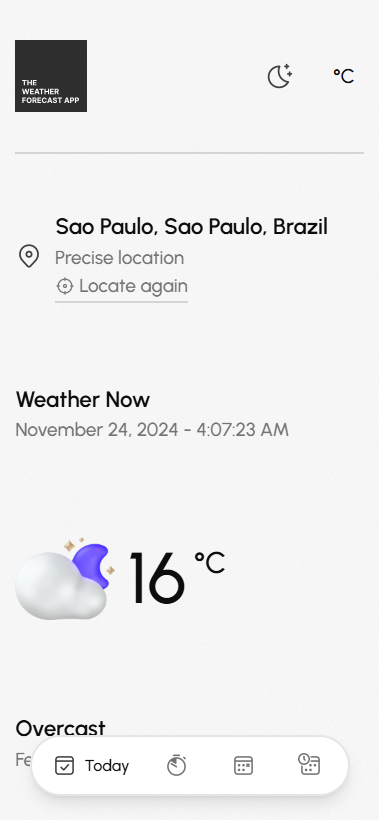
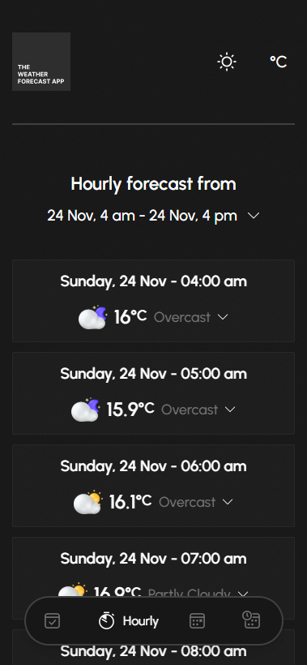
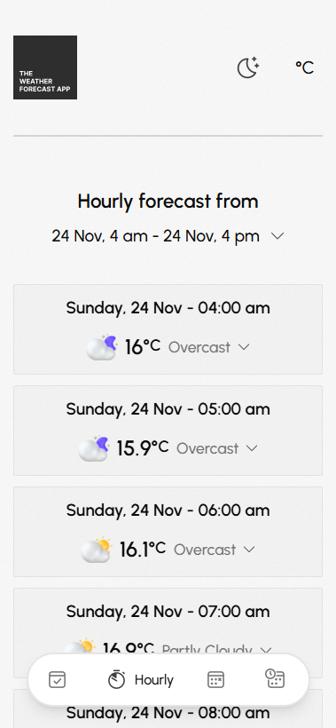
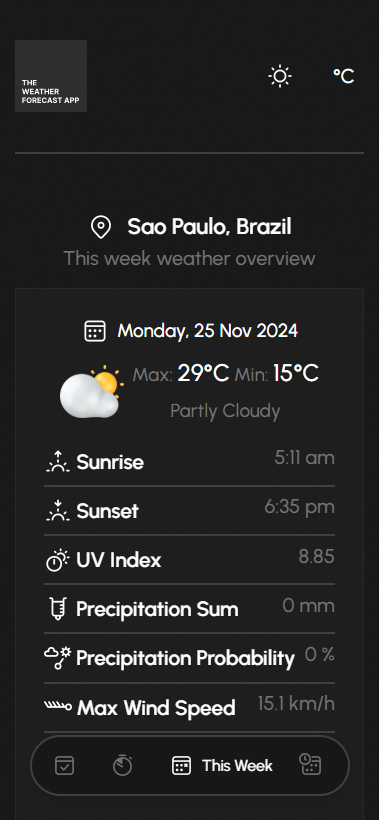

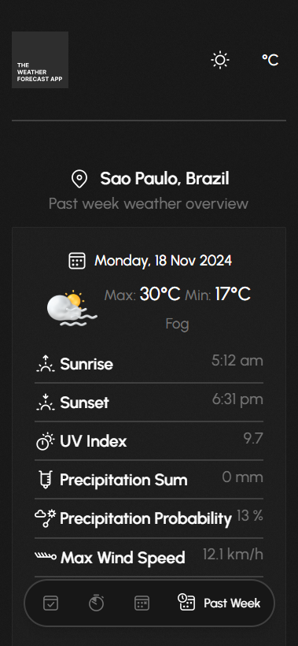
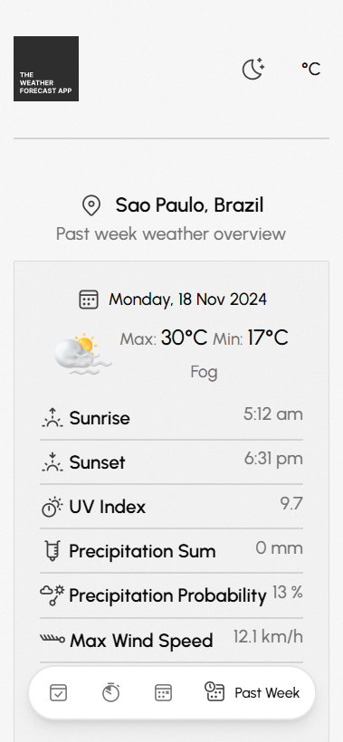

## 🚀 Getting Started

### Installation

1. Clone the repository:

```bash
git clone https://github.com/alraakib/The-Weather-Forecast-App.git
```

2. Change into the project directory:

```bash
cd The-Weather-Forecast-App
```

3. Install the dependencies:

```bash
npm install
```

### Usage

1. Start the development server:

```bash
npm run dev
```

2. Open your web browser and navigate to `http://localhost:3000` to see the app in action.

### Deployment

To build the project for production, use the following command:

```bash
npm run build
```

This will generate the optimized and minified files in the `dist` directory, ready for deployment.

## 📧 Contact

Al Rakib - [alraakib@gmail.com](mailto:alraakib@gmail.com)

Project Link: [The Weather Forecast App](https://github.com/alraakib/The-Weather-Forecast-App)

-----


Made with ❤️ by **Al Rakib**